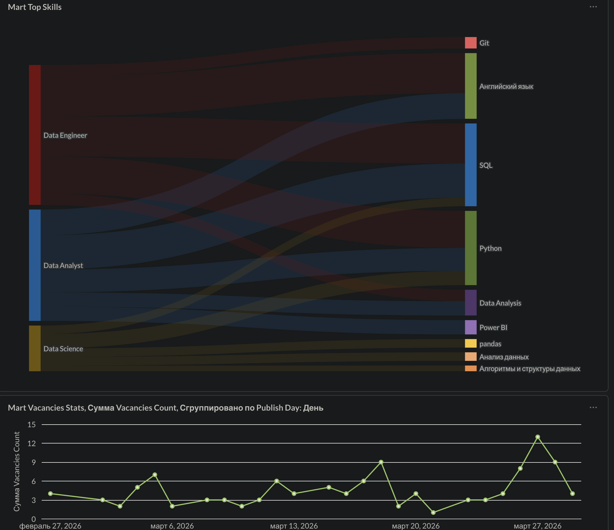

# Data Engineering Capstone

**Belarus IT Job Market Analytics** — a batch pipeline that tracks Data Engineer, Data Analyst and Data Scientist vacancies on [rabota.by](https://rabota.by) (powered by HH.ru API). Monitors vacancy dynamics over time, required experience levels, and top-5 in-demand skills per role.

> **Course:** [Data Engineering Zoomcamp 2026](https://github.com/DataTalksClub/data-engineering-zoomcamp) by DataTalksClub
> **Constraint:** 100% local stack — no cloud services required.

## Dashboard Preview


---

## Architecture

```
┌─────────────────────────────────────────────────────────────────┐
│                        LOCAL STACK                              │
│                                                                 │
│  ┌──────────────┐    ┌──────────────────────────────────────┐   │
│  │  HH.ru API   │───▶│           Bruin Pipeline             │   │
│  │ (rabota.by)  │    │                                      │   │
│  └──────────────┘    │  ┌────────────────────────────────┐  │   │
│                      │  │  01_extract_hh.py  [BRONZE]    │  │   │
│                      │  │  Python · requests · pandas    │  │   │
│                      │  └───────────────┬────────────────┘  │   │
│                      │                  │ raw_vacancies     │   │
│                      │  ┌───────────────▼────────────────┐  │   │
│                      │  │  02_stg_vacancies.sql [SILVER] │  │   │
│                      │  │  Cleaning · date parsing       │  │   │
│                      │  └───────────┬──────────┬─────────┘  │   │
│                      │              │          │            │   │
│                      │  ┌───────────▼──┐  ┌───▼──────────┐  │   │
│                      │  │  03_mart_    │  │  04_mart_    │  │   │
│                      │  │  vacancies_  │  │  top_skills  │  │   │
│                      │  │  stats [GOLD]│  │  .sql [GOLD] │  │   │
│                      │  └───────────┬──┘  └───┬──────────┘  │   │
│                      └─────────────┼──────────┼─────────────┘   │
│                                    │          │                 │
│                      ┌─────────────▼──────────▼─────────────┐   │
│                      │         PostgreSQL (Docker)          │   │
│                      └──────────────────┬───────────────────┘   │
│                                         │                       │
│                      ┌──────────────────▼────────────────────┐  │
│                      │          Metabase (Docker)            │  │
│                      │     Dashboard · Charts · Filters      │  │
│                      └───────────────────────────────────────┘  │
└─────────────────────────────────────────────────────────────────┘
```

---

## Tech Stack

| Layer | Tool | Purpose |
|---|---|---|
| Orchestration | [Bruin CLI](https://github.com/bruin-data/bruin) | Pipeline DAG, asset execution |
| Extraction | Python `requests` + `pandas` | HH.ru API parsing |
| Storage | PostgreSQL 15 (Docker) | Data warehouse |
| BI | Metabase (Docker) | Dashboard & visualization |
| Infrastructure | Docker Compose | Local environment |

---

## Pipeline Layers

### 🥉 Bronze — `extract_hh.py` (Bruin)
Hits the HH.ru API in two passes per vacancy: search query to get IDs,
then a detail request per ID to extract `key_skills`. Collects up to 50
vacancies per role across 3 categories filtered to Belarus (`area=16`).
Loads raw data into `public.raw_vacancies` via Bruin `create+replace`.

### 🥈 Silver — `02_stg_vacancies.sql` (Bruin)
Cleans raw data, parses ISO 8601 timestamps into `timestamptz` and `date`.
Creates view `public.stg_vacancies` with `published_date` and `publish_day`.

### 🥇 Gold — dbt models
Transformations are defined with dbt, sourced from `public.stg_vacancies`.

| Model | Description |
|---|---|
| `mart_vacancies_stats` | Vacancy counts grouped by role, experience, day/week/month. Partitioned by `publish_day`. |
| `mart_top_skills` | Top-5 skills per profession via `STRING_TO_ARRAY` + `UNNEST` + `ROW_NUMBER()` |

---

## Quick Start

### Prerequisites
- [Docker Desktop](https://www.docker.com/products/docker-desktop/)
- [Bruin CLI](https://github.com/bruin-data/bruin) — `brew install bruin-data/tap/bruin`
- Python 3.11+

### 1. Clone & configure

```bash
git clone https://github.com/BlackDeepSky/de-zoomcamp.git
cd de-zoomcamp/Project
```

Create `.env` in the `Project/` directory:
```bash
POSTGRES_USER=data_engineer
POSTGRES_PASSWORD=strong_pass_123
POSTGRES_DB=movies_db
```

### 2. Start infrastructure

```bash
docker-compose up -d
docker-compose ps   # both containers should be healthy
```

### 3. Add Bruin connection

```bash
bruin connections add --env default --type postgres --name pg_local \
  --credentials '{"host":"localhost","port":5433,"username":"data_engineer","password":"strong_pass_123","database":"movies_db"}'

bruin connections list  # verify pg_local appears
```

### 4. Run the pipeline
```bash
# Step 1 — Bronze + Silver via Bruin (run without venv)
bruin run pipeline/ --workers 1

# Step 2 — Gold via dbt (run with venv activated)
cd jobs_dbt
source ../.venv/bin/activate
dbt run
```

### 5. Open Metabase dashboard

Navigate to **http://localhost:3000**

Connect to PostgreSQL using:
- Host: `postgres` (Docker service name)
- Port: `5432`
- Database: `movies_db`
- Username: `data_engineer`
- Password: `strong_pass_123`

---

## Project Structure

```
Project/
├── pipeline/
│   ├── assets/
│   │   ├── 01_extract_hh.py          # Bronze: API extraction
│   │   ├── 02_stg_vacancies.sql      # Silver: cleaning & typing
│   │   ├── 03_mart_vacancies_stats.sql  # Gold: vacancy dynamics
│   │   └── 04_mart_top_skills.sql    # Gold: top-5 skills
│   └── pipeline.yml                  # Bruin pipeline config
├── docker-compose.yaml               # PostgreSQL + Metabase
├── requirements.txt
└── .env                              # ← not committed
```

---

## Data Source

[HH.ru API](https://api.hh.ru) — public REST API, no authentication required for vacancy search. Rate limited to ~5 req/sec; pipeline uses `time.sleep(0.1)` between detail requests.

---

*Part of [Data Engineering Zoomcamp 2026](https://github.com/DataTalksClub/data-engineering-zoomcamp) capstone project.*
